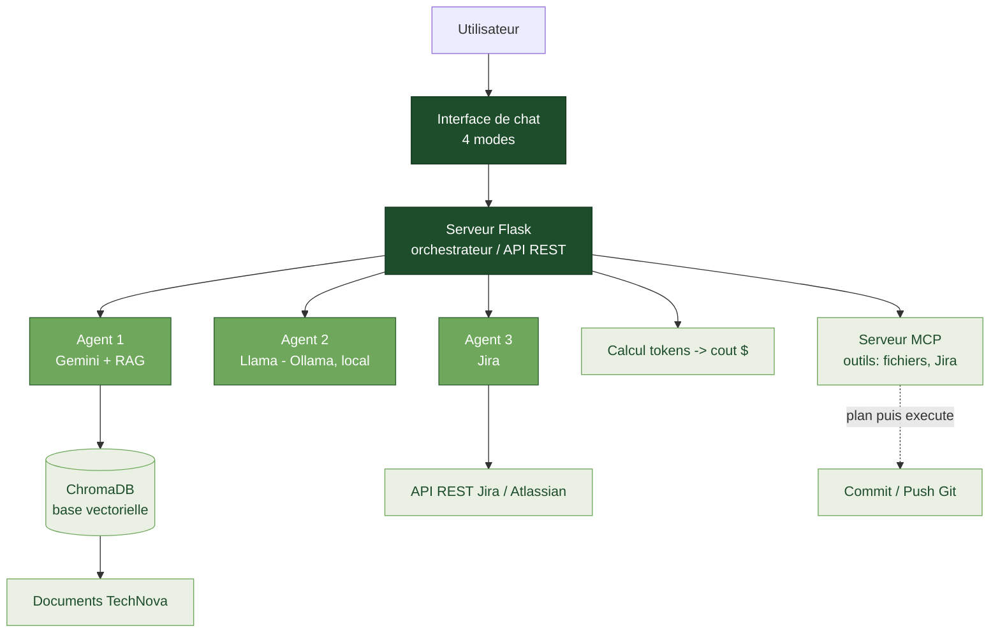

<h1 align="center">Summer Internship — Second Year Computer Science</h1>

<p align="center">
  <em>Travail réalisé pendant mon stage d'été (2ᵉ année Bachelor Informatique)<br>
  centré sur l'Intelligence Artificielle agentique : agents IA, RAG, MCP et automatisation n8n.</em>
</p>

<p align="center">
  
  
  
  
  
  
  
  
</p>

<p align="center">
  <strong>Auteur :</strong> Yessine Louati
</p>

---

## Table des matières

- [Aperçu](#aperçu)
- [Architecture](#architecture)
- [Structure du dépôt](#structure-du-dépôt)
- [1. ai-agent — Application multi-agents](#1-ai-agent--application-web-multi-agents)
- [2. jira-pipeline — Frontend Angular](#2-jira-pipeline--frontend-angular)
- [3. n8n — Automatisations & IA agentique](#3-n8n--automatisations--ia-agentique)
- [4. videos — Démonstrations](#4-videos--démonstrations)
- [Stack technique](#stack-technique)
- [Sécurité](#sécurité)

---

## Aperçu

Ce dépôt regroupe, de façon progressive, l'ensemble des projets construits durant le stage —
des fondations d'un agent IA jusqu'à des architectures avancées mêlant plusieurs agents, la
technique **RAG**, le protocole **MCP** et l'automatisation de bout en bout avec **n8n**.

## Architecture

Vue d'ensemble du projet phare — l'application multi-agents `ai-agent` :



## Structure du dépôt

```
.
├── ai-agent/          Application web multi-agents (Flask) : Gemini+RAG, Llama local, agent Jira, MCP
├── jira-pipeline/     Frontend Angular du pipeline Jira
├── n8n/               Automatisations n8n (météo, agent multi-outils + RAG, MCP) + LangGraph
├── videos/            Vidéos de démonstration (locales, non versionnées — voir videos/VIDEOS.md)
└── README.md
```

---

## 1. `ai-agent` — Application web multi-agents

Application **Flask** réunissant trois agents et une interface de chat à quatre modes.

| Agent | Modèle | Rôle |
|---|---|---|
| **Agent 1** | Gemini 2.5 Flash + **RAG** | Répond à partir des documents *TechNova* (base vectorielle ChromaDB) |
| **Agent 2** | Llama 3.2 (local, Ollama) | Sans RAG — sert de comparaison |
| **Agent 3** | Jira | Lit un ticket via l'API REST Atlassian, détecte l'intention, délègue à l'agent 1 ou 2 |

Intégration **MCP** (Model Context Protocol) : résolution de tickets en deux temps
(*plan* → *execute*) avec commit/push Git. Modes d'interface : chat simple · comparaison des
deux agents (tokens + coût $) · dialogue entre agents · agent Jira.

> Détails et démarrage : [`ai-agent/README.md`](ai-agent/README.md)

## 2. `jira-pipeline` — Frontend Angular

Interface **Angular 21** accompagnant le pipeline Jira.

> Détails et démarrage : [`jira-pipeline/README.md`](jira-pipeline/README.md)

## 3. `n8n` — Automatisations & IA agentique

| Dossier | Contenu |
|---|---|
| `phase-1-meteo/` | Bulletin météo quotidien automatisé (OpenWeatherMap → Gmail) |
| `phase-2-rag-tools/` | Agent IA multi-outils local (calcul, météo, RAG) avec Ollama |
| `phase-3-mcp/` | Même agent où les outils sont remplacés par des serveurs MCP |
| `langgraph/` | Agent ReAct construit avec LangGraph (notebook) |
| `workflow-to-python/` | Conversions des workflows en Python |

Chaque phase contient son workflow `.json` (importable dans n8n) et sa fiche `.md`.

> Détails et démarrage : [`n8n/README.md`](n8n/README.md)

## 4. `videos` — Démonstrations

Vidéos de démonstration. Trop volumineuses pour GitHub (> 100 Mo), elles restent **locales**
et ne sont pas versionnées. Description et scripts : [`videos/VIDEOS.md`](videos/VIDEOS.md).

---

## Stack technique

**Langages** : Python · TypeScript · JavaScript
**IA** : LangChain · LangGraph · Gemini · Llama & Qwen (Ollama) · ChromaDB (RAG) · MCP
**Backend / Frontend** : Flask · Angular
**Automatisation & intégrations** : n8n · API Jira · OpenWeatherMap · Gmail · Git

## Sécurité

Les fichiers `.env` (clés API) et les artefacts lourds (`venv/`, `node_modules/`, `dist/`,
base vectorielle, vidéos) sont exclus via `.gitignore`. Utilisez les fichiers `.env.example`
comme modèles.
