# Projet de stage — Agents IA TechNova

## En une phrase

Ce projet met en place trois assistants intelligents qui travaillent ensemble : deux d'entre eux peuvent répondre à des questions (l'un en s'appuyant sur les documents internes de l'entreprise, l'autre de façon plus libre), et le troisième sait lire un ticket de suivi de bugs (Jira) pour demander automatiquement aux deux premiers de corriger un problème ou d'écrire du code.

## Pourquoi ce projet existe

Lors d'un stage, on m'a demandé de construire un système où plusieurs intelligences artificielles collaborent, plutôt que d'utiliser une seule IA isolée. L'idée est de se rapprocher de ce qui se fait en entreprise : des services indépendants, chacun avec une responsabilité précise, qui communiquent entre eux de façon sécurisée — plutôt qu'un seul gros programme qui fait tout.

## Vue d'ensemble — les trois agents

| Agent | Rôle | Particularité |
|---|---|---|
| **Agent 1 — Gemini** | Répond aux questions en s'appuyant sur des documents internes de l'entreprise | Utilise un système de recherche documentaire (RAG) pour rester précis et factuel |
| **Agent 2 — Llama** | Répond aux questions de façon plus générale | Tourne entièrement sur l'ordinateur, gratuit et sans connexion internet |
| **Agent 3 — Jira** | Lit un ticket de suivi (bug ou demande de fonctionnalité) et le transmet à l'agent 1 ou 2 | Ne répond jamais lui-même : il prépare le travail pour un autre agent |

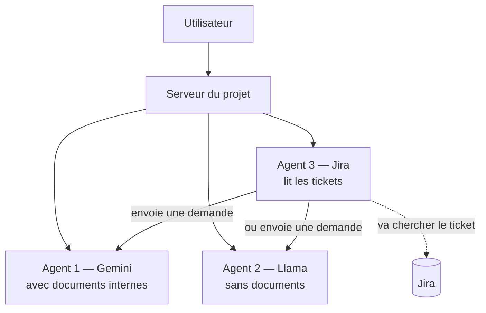

## Étape 1 — Un système de recherche documentaire (RAG)

**Le problème de départ** : une intelligence artificielle ne connaît pas les documents internes d'une entreprise. Si on lui demande "combien de jours de congés ai-je ?", elle ne peut pas savoir la réponse propre à TechNova.

**La solution** : avant de répondre, on fait chercher à l'IA les passages pertinents dans les vrais documents de l'entreprise, puis on lui demande de répondre en se basant sur ce qu'elle a trouvé.

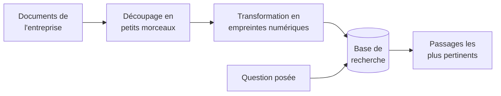

Concrètement, les documents sont coupés en petits morceaux, chaque morceau est transformé en une sorte d'empreinte numérique qui représente son sens, et le tout est stocké dans une base de recherche. Quand une question arrive, elle est transformée en empreinte de la même façon, et on retrouve les morceaux dont l'empreinte est la plus proche — un peu comme retrouver les chansons les plus proches d'un air qu'on fredonne.

## Étape 2 — Agent 1, qui utilise ce système

L'Agent 1 reçoit une question, va chercher le contexte pertinent dans les documents (étape 1), puis demande à Gemini (le modèle d'intelligence artificielle de Google) de répondre en se basant sur ce contexte. On lui a donné une consigne claire : rester fidèle aux documents quand la question s'y rapporte, et répondre normalement sinon, pour éviter qu'il invente des informations.

**Découverte intéressante pendant les tests** : les modèles Gemini récents font un raisonnement interne avant de répondre, invisible dans le texte final mais qui compte dans la consommation et le coût. Il a fallu adapter la mesure pour ne pas sous-estimer le coût réel d'environ 20 à 30 %.

## Étape 3 — Agent 2, sans système de recherche

L'Agent 2 utilise Llama, un modèle qui tourne directement sur l'ordinateur, sans connexion à un service externe payant. Il répond uniquement avec ses connaissances générales, sans accès aux documents de l'entreprise — volontairement, pour pouvoir comparer les deux approches.

**Ce que la comparaison a montré** : sur la question des congés, l'Agent 1 a répondu exactement "21 jours" (la vraie information de l'entreprise), tandis que l'Agent 2 a inventé une réponse générale sur le droit du travail dans plusieurs pays, sans lien avec l'entreprise réelle. L'Agent 1 coûte environ 15 fois plus cher à utiliser, mais cette fiabilité justifie la différence de coût.

## Étape 4 — Faire dialoguer les deux agents

Les deux agents ont aussi été mis en conversation l'un avec l'autre sur plusieurs tours : l'un répond, l'autre réagit à cette réponse, et ainsi de suite. Un résultat marquant : l'Agent 1, fidèle aux documents, a explicitement signalé que l'Agent 2 avait ajouté des informations non vérifiées — une bonne illustration concrète de l'intérêt d'un système de recherche documentaire pour limiter les erreurs.

## Étape 5 — Mesurer et comparer le coût

Un module dédié convertit la consommation de chaque agent en coût réel, en se basant sur les tarifs officiels publiés par Google. Pour l'Agent 2, qui est réellement gratuit, un coût simulé est aussi calculé (comme s'il était hébergé sur un service payant équivalent), pour permettre une comparaison de valeur entre les deux approches plutôt qu'une comparaison "gratuit contre payant" qui n'apporterait pas d'information utile.

## Étape 6 et 7 — Le serveur et l'interface

Un serveur fait le lien entre une interface de discussion (accessible dans un navigateur, avec un thème sombre) et tout le travail des agents. L'interface propose trois façons d'interagir : poser une question à un agent au choix, comparer les deux agents sur la même question, ou les faire dialoguer entre eux. Un bouton permet aussi d'ajouter directement un nouveau document, qui est immédiatement intégré à la base de recherche.

---

## Mission 2 — Donner à chaque agent sa propre API, et créer l'Agent 3 (Jira)

Après une première présentation, deux nouvelles demandes ont été formulées :

1. Que chaque agent dispose de sa propre adresse d'accès indépendante, protégée par une clé secrète, pour pouvoir être utilisé depuis n'importe quel autre projet ou ordinateur.
2. La création d'un troisième agent capable de lire un ticket Jira et de transmettre la bonne instruction à l'un des deux premiers agents.

### Une adresse et une clé pour chaque agent

Chaque agent a maintenant sa propre adresse d'accès, et chaque adresse exige une clé secrète propre à cet agent pour être utilisée — exactement comme il faut une clé pour utiliser les services de Google ou d'OpenAI. Sans la bonne clé, l'accès est refusé.

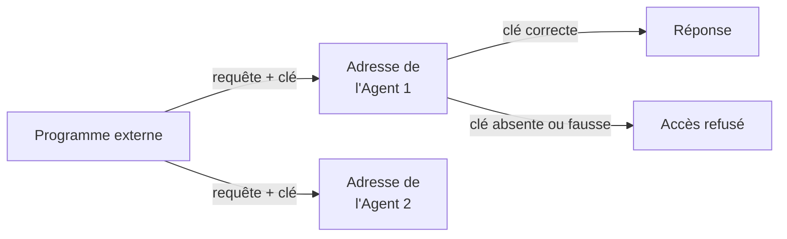

Ces deux nouvelles adresses ont été testées directement depuis un terminal, sans passer par l'interface graphique, pour prouver qu'un programme totalement extérieur au projet peut utiliser les agents.

### L'Agent 3 — comment il fonctionne

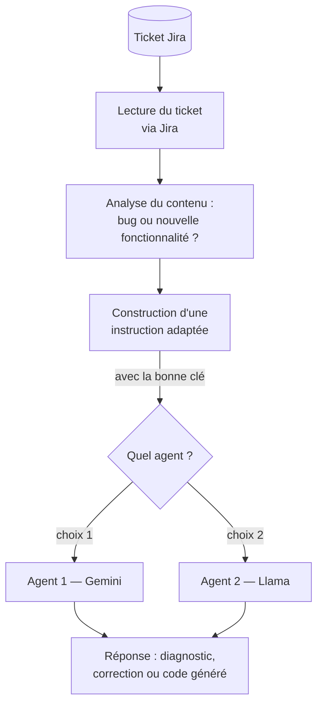

Concrètement, l'Agent 3 va chercher un ticket sur Jira (le titre, la description, le type), comprend s'il décrit un problème à corriger ou une nouvelle fonctionnalité à créer, prépare un message clair pour résumer cette demande, puis l'envoie à l'Agent 1 ou à l'Agent 2 — en utilisant la même clé secrète que n'importe quel autre programme externe utiliserait.

**Deux tickets de test ont validé ce fonctionnement** :
- Un ticket de type bug (mauvais symbole de devise affiché) : l'agent a correctement diagnostiqué le problème et proposé une correction de code.
- Un ticket demandant une nouvelle fonctionnalité (calcul de remise selon l'ancienneté d'un client) : l'agent a généré une vraie fonction de code complète et testée.

### Une remarque importante reçue de l'encadrant, et sa correction

En présentant ce travail, l'encadrant a fait une observation utile sur l'architecture du projet : à l'époque, le serveur principal communiquait de deux façons différentes avec les agents. Avec l'Agent 3 (Jira), il passait toujours par l'adresse sécurisée et la clé — exactement comme un programme externe le ferait. Mais pour les autres fonctionnalités de l'interface (poser une question, comparer, dialoguer), le serveur appelait directement le code interne des agents, sans passer par cette même adresse sécurisée.

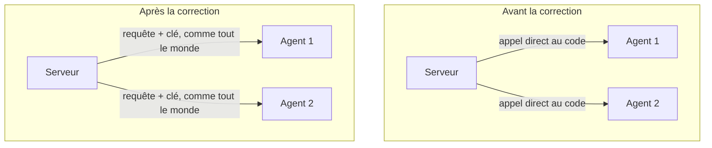

**Ce problème a été corrigé.** Toute communication avec un agent, même venant du propre serveur du projet pour ses propres fonctionnalités d'interface, passe désormais par la même règle : une requête avec une adresse et une clé, plutôt qu'un accès direct au code interne. Une fonction centrale unique (`appeler_agent_interne`) a été créée et est utilisée par toutes les fonctionnalités qui doivent consulter un agent, y compris le dialogue entre les deux agents.

**Un piège technique découvert et corrigé au passage** : en appliquant ce principe une première fois, la règle avait été posée trop largement, y compris sur les adresses qui *sont elles-mêmes* la porte d'entrée officielle de chaque agent. Cela créait une boucle sans fin : l'adresse de l'Agent 1 essayait de s'appeler elle-même indéfiniment pour obtenir sa propre réponse, ce qui bloquait complètement le système. La correction a consisté à bien distinguer deux rôles : les fonctionnalités de l'interface (qui doivent passer par l'adresse sécurisée) d'une part, et l'adresse officielle de chaque agent elle-même (qui doit rester le point où le vrai travail s'exécute, sans quoi rien ne pourrait jamais s'exécuter du tout) d'autre part.

Le résultat final répond à la demande initiale tout en évitant ce piège : les agents sont maintenant véritablement indépendants les uns des autres, chacun pourrait être déplacé sur une autre machine sans casser le reste du projet, et une seule règle de sécurité s'applique de façon cohérente partout.

---

## Mission 3 — Amélioration du prompt de l'Agent Jira et intégration du protocole MCP

Après validation de la mission 2, trois nouvelles améliorations ont été apportées au projet.

### Amélioration 1 — Un prompt généré dynamiquement par l'IA elle-même

**Le problème de départ** : le prompt envoyé à l'Agent 1 ou 2 pour traiter un ticket Jira était écrit manuellement dans le code Python. Ce texte fixe ne s'adaptait pas vraiment au contenu du ticket — il appliquait toujours la même formulation, quel que soit le type de tâche décrite.

**La solution apportée** : au lieu d'écrire le prompt dans le code, on demande maintenant à Gemini de le générer lui-même, en analysant le ticket. Ce prompt généré — appelé `promptToDevelopAgent` — est ensuite transmis à l'Agent 1 ou 2 pour traiter la tâche.

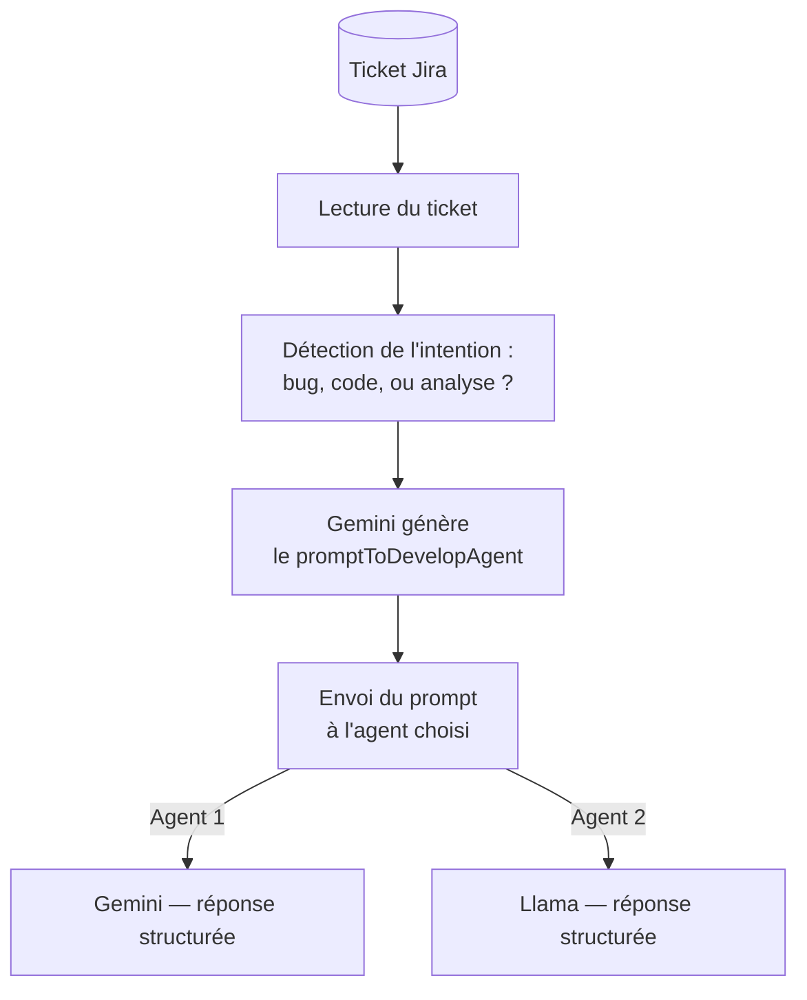

Ce fonctionnement en deux temps — un premier appel pour générer le prompt, un second pour exécuter la tâche — est plus flexible : le prompt s'adapte automatiquement à chaque ticket, qu'il décrive un bug, une nouvelle fonctionnalité, ou n'importe quel autre type de tâche.

**La structure de réponse imposée** : selon l'intention détectée, le prompt généré demande à l'agent une réponse organisée en sections précises.

Pour un bug :
- Diagnostic : cause probable du problème
- Solution proposée : correction avec exemple de code
- Points d'attention : effets de bord et tests à effectuer
- Critères de validation : conditions qui confirment que le bug est résolu

Pour une nouvelle fonctionnalité :
- Compréhension du besoin : reformulation de la demande
- Approche technique : stratégie d'implémentation choisie
- Code généré : code complet, propre et commenté
- Intégration : comment intégrer la solution dans le projet existant

Pour une analyse générale :
- Résumé du ticket : ce qui est demandé en termes clairs
- Analyse technique : enjeux, dépendances et risques
- Plan d'action : étapes concrètes et priorisées
- Recommandations : conseils basés sur les meilleures pratiques

**Deux tickets ont validé ce fonctionnement** :
- SCRUM-1 (bug d'affichage de devise) : l'agent a produit un diagnostic complet, deux options de correction avec code JSX, les points d'attention et les critères de validation.
- SCRUM-2 (nouvelle fonctionnalité de calcul de remise) : l'agent a généré une fonction Python complète avec docstring, gestion des erreurs, exemples d'utilisation et cas limites.

### Amélioration 2 — Intégration du protocole MCP

**Ce qu'est MCP** : le Model Context Protocol est un standard ouvert qui permet à un outil d'intelligence artificielle (comme Claude Desktop ou Cursor) d'appeler des fonctions extérieures de façon structurée. Un programme qui expose ses fonctions via MCP devient utilisable depuis n'importe quel client compatible, sans avoir à créer une intégration spécifique à chaque fois.

**Ce qui a été ajouté** : le projet expose maintenant ses fonctionnalités Jira via MCP, sous forme de cinq outils accessibles depuis l'extérieur — dont un outil de recherche de projet sur le PC.

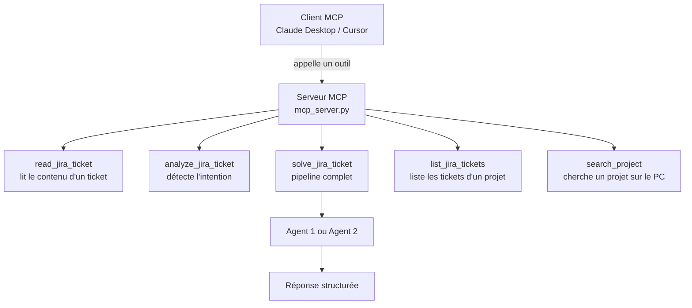

| Outil MCP | Ce qu'il fait |
|---|---|
| `read_jira_ticket` | Lit un ticket et retourne son titre, description, type et statut |
| `analyze_jira_ticket` | Détecte l'intention du ticket sans appeler un agent IA |
| `solve_jira_ticket` | Pipeline complet : lecture, génération du prompt, réponse de l'agent |
| `list_jira_tickets` | Liste les tickets récents d'un projet Jira |
| `search_project` | Cherche un dossier projet sur le PC par nom ou mot-clé |

### Amélioration 3 — Un client MCP intégré au projet

En plus d'exposer ses fonctions via MCP, le projet intègre aussi un client MCP : une nouvelle route du serveur (`/api/mcp/chat`) permet de poser une question en langage naturel, et c'est l'agent lui-même qui décide quel outil utiliser pour y répondre.

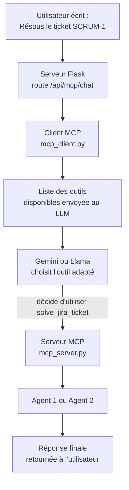

Concrètement, quand l'utilisateur écrit "Résous le ticket SCRUM-1", le LLM reçoit la liste des outils disponibles, réfléchit à lequel utiliser, demande l'exécution de `solve_jira_ticket`, reçoit le résultat, puis formule une réponse finale. L'utilisateur n'a pas besoin de connaître les outils — il écrit simplement sa demande en langage naturel.

**Ce que ce fonctionnement change concrètement** : le projet peut maintenant être utilisé de deux façons indépendantes — via l'interface graphique comme avant, ou via n'importe quel client MCP compatible, sans modifier une seule ligne du code existant.

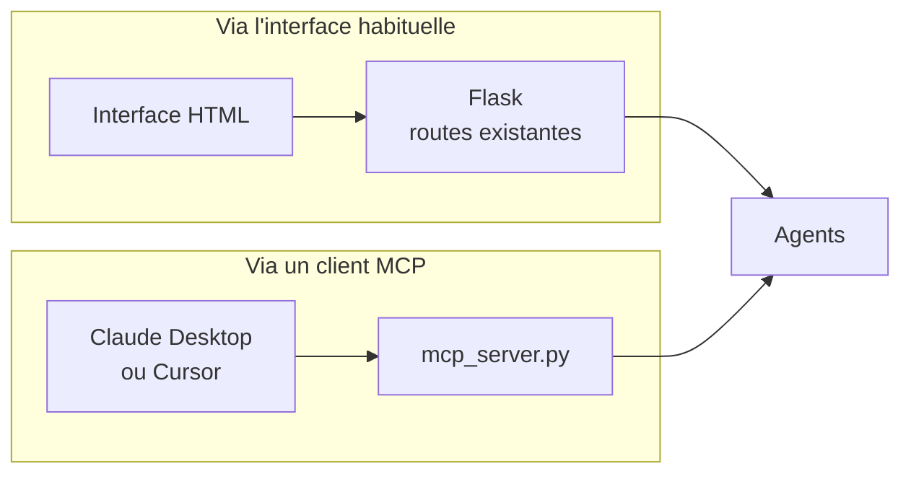

Les deux modes coexistent dans le même projet, partagent les mêmes agents, et n'interfèrent pas l'un avec l'autre.

---

## Mission 4 — L'agent agit vraiment sur les fichiers du PC

Jusqu'ici, quand un ticket demandait de créer ou corriger du code, l'agent répondait avec une explication et le code à appliquer — mais c'était au développeur de copier-coller lui-même. Cette mission ajoute la capacité à l'agent d'agir directement sur les fichiers du projet concerné.

### Ce qui a changé

L'agent ne se contente plus de répondre avec du texte. Il va maintenant chercher le projet sur le PC, lit les fichiers concernés, crée ou modifie les fichiers nécessaires, et explique ce qu'il a fait — tout ça automatiquement, en une seule commande.

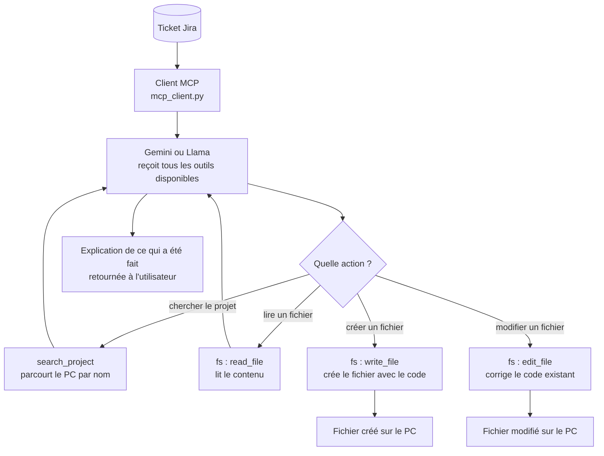

### Deux serveurs MCP en parallèle

Pour donner à l'agent accès à la fois aux tickets Jira et aux fichiers du PC, le client MCP connecte maintenant deux serveurs en même temps. L'agent reçoit tous les outils des deux serveurs et choisit lui-même lesquels utiliser selon la tâche.

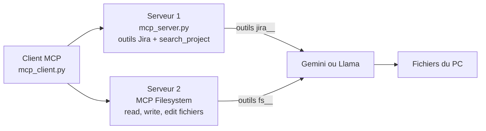

Les outils du serveur Jira sont préfixés `jira__` et ceux du serveur filesystem sont préfixés `fs__` — ce qui permet à l'agent de savoir sur quel serveur appeler chaque outil, sans confusion.

### Un exemple concret — ticket SCRUM-3

Le ticket demandait d'ajouter un système de logging au projet CASS TSYP13. Voici exactement ce que l'agent a fait automatiquement, sans aucune intervention manuelle :

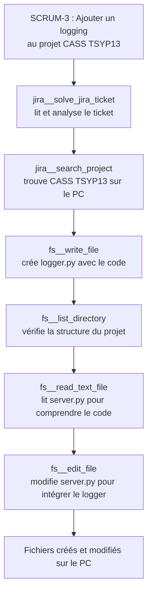

L'agent a non seulement créé le fichier demandé, mais a aussi modifié le fichier existant pour intégrer la nouvelle fonctionnalité — exactement comme un développeur le ferait.

### Un système de confirmation avant action

Pour éviter que l'agent modifie des fichiers sans que le développeur ne le sache, un système de confirmation a été ajouté — inspiré du bouton "Accept" de GitHub Copilot. Avant d'exécuter quoi que ce soit, l'agent affiche son plan d'action complet et attend une réponse.

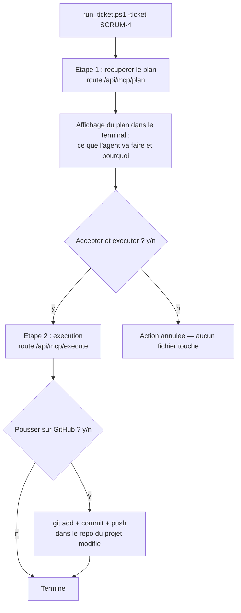

Concrètement, le développeur lance une seule commande dans le terminal, lit le plan affiché, tape `y` pour accepter ou `n` pour refuser, puis confirme ou non le push sur GitHub. Tout le reste est géré automatiquement.

### Le push GitHub automatique

Après chaque exécution acceptée, le script propose de pousser les changements sur GitHub. Si le développeur accepte, le script trouve automatiquement le repo Git du projet modifié, propose un message de commit ou en génère un automatiquement, puis exécute `git add`, `git commit` et `git push` — directement dans le repo du projet modifié, pas dans le repo du projet de stage.

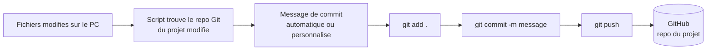

---

---

## Mission 5 — Une interface visuelle : « Jira Pipeline » (Angular)

Après la mission 4, l'encadrant a demandé une **interface visuelle** qui montre clairement — comme le fait Postman — ce qui se passe quand on traite un ticket, et qui affiche le déroulé du travail étape par étape, comme un pipeline.

### Deux projets qui tournent ensemble

L'interface a été construite avec **Angular** (un framework pour créer des pages web), dans un projet séparé du serveur Flask. Les deux tournent en même temps et communiquent entre eux.

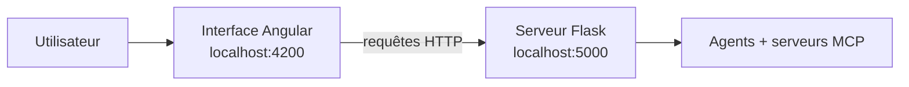

### Ce que fait l'interface

L'interface propose **deux outils côte à côte** :

1. **Le pipeline de traitement** — on saisit la clé d'un ticket (ex. `SCRUM-3`), on choisit l'agent, et les étapes s'allument une par une pendant le traitement.
2. **Le testeur d'API** — comme Postman : on choisit une méthode (GET, POST, …), une adresse, un contenu, et on voit la réponse brute du serveur. Pratique pour tester les routes sans passer par l'interface graphique.

### Le workflow du pipeline

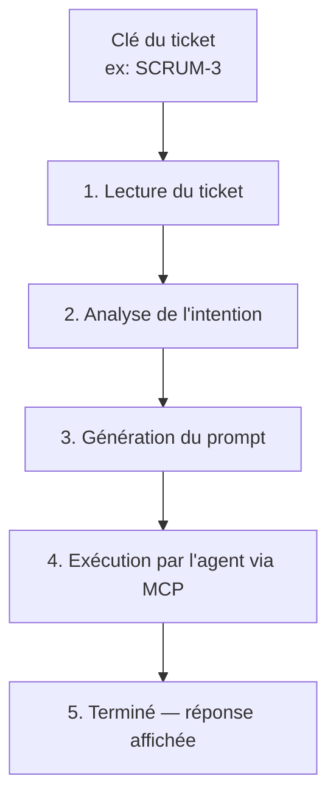

Pour rester fidèle à la réalité, l'interface ne « simule » pas ces étapes : elle appelle vraiment le serveur. Les trois premières étapes viennent d'une nouvelle route `/api/pipeline/prepare` (lecture du ticket, détection de l'intention, construction du prompt), et la quatrième d'une route `/api/mcp/run` qui **exécute réellement** les outils MCP — et agit donc vraiment sur les fichiers.

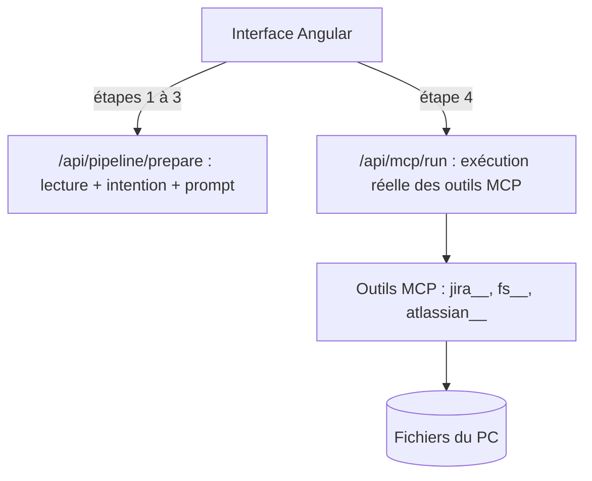

### L'architecture d'exécution, montrée en clair

Le point le plus utile pour comprendre : l'interface affiche **chaque outil MCP réellement appelé**, sous forme d'un enchaînement — un vrai diagramme d'architecture — avec, pour chaque étape, une icône, un titre lisible et le fichier concerné. Le détail (arguments et résultat complet) s'ouvre au clic, pour ne pas noyer l'écran sous un mur de texte.

Exemple réel avec le ticket SCRUM-3 :

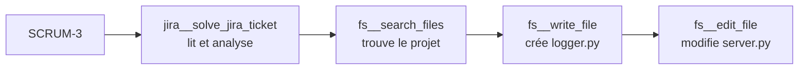

---

## Mission 6 — Trois serveurs MCP, sécurité et nettoyage

### Un troisième serveur MCP : mcp-atlassian

À la mission 4, le client MCP connectait deux serveurs (le serveur Jira maison + les fichiers). Il en connecte maintenant **trois**, en ajoutant `mcp-atlassian`, un serveur officiel qui donne un accès Jira standard (recherche de tickets, requêtes JQL, etc.).

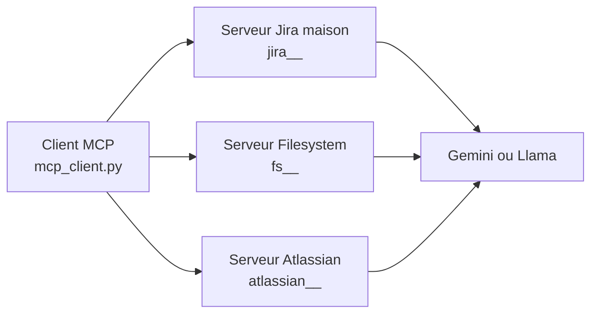

La répartition des rôles est claire :
- **Notre serveur maison** (`mcp_server.py`) n'expose plus qu'**un seul** outil sur mesure, celui que personne d'autre ne fournit : `solve_jira_ticket` (le pipeline complet : intention + prompt + réponse d'ingénieur senior).
- **Le serveur filesystem** se charge de tout ce qui touche aux fichiers, y compris **trouver un projet par nom** grâce à son outil `search_files`. Un détail important a été découvert au passage : pour chercher un dossier imbriqué, il faut lui donner un motif **récursif** `**/NOM` (un simple `*` ne descend pas dans les sous-dossiers) — cette consigne est donnée automatiquement à l'agent.
- **mcp-atlassian** fournit tout l'accès Jira « standard ».

*(Choix d'ingénierie : au départ, notre serveur maison proposait aussi un outil `search_project` qui parcourait tout le disque. On l'a retiré en constatant que le serveur filesystem faisait déjà ce travail avec `search_files`, à l'intérieur du dossier autorisé. Résultat : une seule porte d'entrée vers les fichiers, cohérente avec la restriction de sécurité, et moins de code à maintenir.)*

### Sécurité : limiter l'accès de l'agent aux fichiers

Au départ, le serveur de fichiers donnait à l'agent un accès en écriture à **tout le disque `C:`** — un risque : un mauvais prompt aurait pu toucher des fichiers système. L'accès est désormais **restreint au dossier de travail**, réglable via une variable d'environnement `MCP_FS_ROOT`.

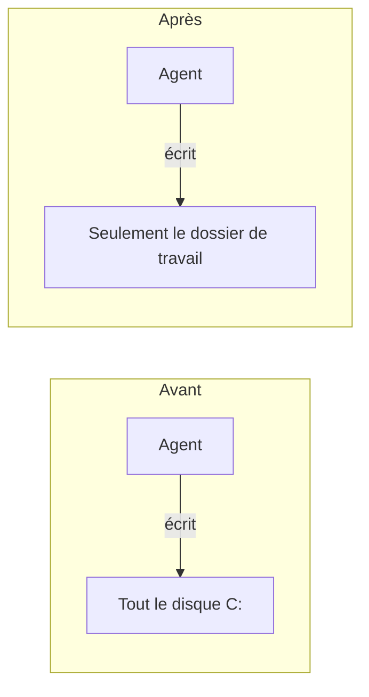

### Une revue de code

Enfin, une revue complète des deux projets a permis de nettoyer le code **sans rien casser** : suppression de code mort (une table de tarifs dupliquée, une route et un garde-fou devenus inutiles, une dépendance non utilisée), réparation d'un bout de HTML mal fermé, meilleure trace des erreurs des agents dans le terminal, et retrait d'un import Angular inutile. Résultat : un code plus propre, plus sûr, et plus facile à relire.

---

## Limites connues à ce stade

- L'accès aux agents depuis un autre ordinateur du même réseau fonctionne. L'accès depuis un téléphone connecté au même réseau Wi-Fi ne fonctionne pas encore, probablement à cause d'un réglage du routeur qui isole les appareils entre eux pour des raisons de sécurité — un point indépendant du projet lui-même, encore en cours d'investigation.
- Le tarif simulé utilisé pour comparer le coût de l'Agent 2 (gratuit en réalité) à un service payant équivalent est une estimation, pas un tarif officiel vérifié.
- La détection de l'intention d'un ticket Jira (bug ou nouvelle fonctionnalité) repose sur une recherche de mots-clés simples, pas sur un modèle d'intelligence artificielle dédié à cette tâche — un choix volontaire pour rester rapide et facile à expliquer.
- Le serveur tourne actuellement en mode développement, adapté à une démonstration mais pas à un usage en production avec de nombreux utilisateurs.
- La génération du `promptToDevelopAgent` consomme un appel supplémentaire à l'API Gemini avant chaque traitement de ticket — ce qui double le nombre d'appels pour cette fonctionnalité et augmente légèrement le coût et le temps de réponse.
- L'API Gemini gratuite est limitée à 20 requêtes par jour — au-delà de cette limite, le système retourne une erreur 429. Pour un usage intensif, un abonnement payant ou l'utilisation de l'Agent 2 (Llama, gratuit et sans limite) est recommandé.
- La recherche d'un projet par nom se fait désormais avec l'outil `search_files` du serveur filesystem, à l'intérieur du dossier de travail. Sur un dossier volumineux, la recherche récursive peut prendre quelques secondes.
- L'interface Angular et le serveur Flask sont deux projets séparés qui doivent tourner **en même temps** (ports 4200 et 5000) pour que le pipeline fonctionne.
- Dans le pipeline visuel, les trois premières étapes s'affichent avec un court délai pour l'effet « une étape à la fois » ; seule l'étape d'exécution de l'agent est réellement en temps réel. Un affichage totalement « en direct » (chaque outil au moment exact où il s'exécute) nécessiterait une technique de streaming (SSE) qui n'est pas encore en place.
- Depuis la restriction de sécurité, l'agent ne peut agir que sur les fichiers situés dans le dossier de travail ; un projet placé ailleurs ne serait pas accessible sans élargir la configuration (`MCP_FS_ROOT`).
