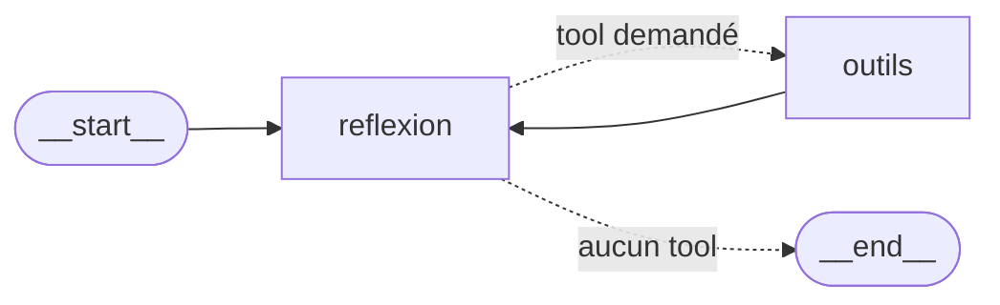

# Agent ReAct avec LangGraph 🦜🕸️

Un agent qui **raisonne** puis **agit** (appelle des outils) en boucle, construit **à la main** avec LangGraph — sans utiliser `create_react_agent`. Tout tourne **en local** avec Ollama.

---

## 1. Le pattern ReAct (Reason + Act)

L'agent ne répond pas d'un coup : il **réfléchit**, **agit** (appelle un outil), **re-réfléchit** avec le résultat, et recommence jusqu'à la réponse finale.

```
réfléchir → agir (tool) → re-réfléchir → agir → … → réponse
```

---

## 2. Architecture — le graphe



Version texte :
```
        ┌─────────────┐
        │  __start__  │
        └──────┬──────┘
               ▼
        ┌─────────────┐   aucun tool
        │  reflexion  │ ─────────────►  __end__
        │  (cerveau)  │
        └──────┬──────┘ ◄─────────┐
               │ tool demandé      │  (boucle)
               ▼                   │
        ┌─────────────┐            │
        │   outils    │ ───────────┘
        │  (ToolNode) │
        └─────────────┘
```

La **boucle** `outils → reflexion` et la **condition** après `reflexion` sont ce qui rend ce graphe plus puissant qu'une simple chaîne.

---

## 3. Les composants

| Composant | Rôle |
|-----------|------|
| **MessagesState** | L'état partagé : contient la liste des messages (l'historique). Circule entre les nodes. |
| **reflexion** (node) | Appelle le LLM avec l'historique. Le LLM décide : répondre, ou demander un outil. |
| **outils** (node = ToolNode) | Exécute automatiquement les outils demandés par l'agent. |
| **should_continue** | La condition (carrefour) : si le LLM a demandé un outil → `outils`, sinon → `END`. |
| **Tools** | `triple` (multiplie par 3) et `meteo` (appel API OpenWeatherMap). |
| **Modèle** | Ollama local (`qwen3:4b` / `llama3.2`) avec `.bind_tools(tools)`. |

---

## 4. Le flux sur un exemple

Question : *« Météo à Sfax puis triple la température. »*

1. **reflexion** → le LLM demande l'outil `meteo`.
2. **outils** → récupère 31.85°C.
3. **reflexion** → le LLM demande l'outil `triple`.
4. **outils** → renvoie 95.55.
5. **reflexion** → plus de tool à appeler → **END**.
6. Réponse finale : *« À Sfax il fait 31.85°C… triplée = 95.55°C. »*

---

## 5. Concepts clés (LangGraph)

- **StateGraph** — construire un graphe qui fait circuler un état.
- **add_node / set_entry_point** — ajouter des boîtes et définir le départ.
- **add_conditional_edges** — un `IF` dans le graphe (aiguillage selon une condition).
- **add_edge (boucle)** — relier `outils → reflexion` pour répéter.
- **bind_tools** — attacher les outils au modèle.
- **ToolNode** — brique prête qui exécute les outils.

---

## 6. Lancer

```bash
pip install langchain langchain-ollama langgraph requests ipykernel
```
Ollama doit tourner avec le modèle choisi. Ouvrir `react_agent.ipynb` et exécuter les cellules dans l'ordre.
